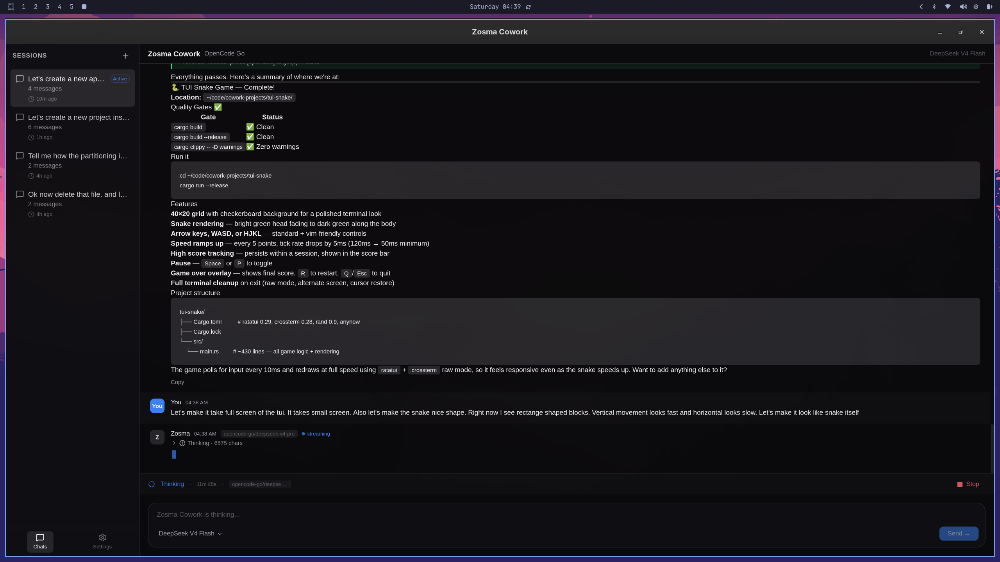

# Zosma Cowork 🇮🇳

[English](./README.md) | [中文](./README.zh.md) | [Español](./README.es.md) | [日本語](./README.ja.md) | [Deutsch](./README.de.md) | **Français** | [Português](./README.pt.md) | [Русский](./README.ru.md) | [한국어](./README.ko.md) | [हिंदी](./README.hi.md)

[](https://github.com/zosmaai/zosma-cowork/actions/workflows/ci.yml)
[](https://github.com/zosmaai/zosma-cowork/actions/workflows/release.yml)
[](https://opensource.org/licenses/MIT)
[](https://zosma.ai)

> Un collaborateur IA de bureau propulsé par le [SDK pi agent](https://github.com/earendil-works/pi-coding-agent) — streaming, processus de pensée, appels d'outils, sessions multi-tours et pilotage, le tout dans une belle application native.

> 🇮🇳 **India's first Non-Coding Agentic Work Harness**
>
> **From India to the World 🌏 — Made with ❤️ by [Zosma AI](https://zosma.ai)**



## Fonctionnalités

- **Exécution de l'agent en processus** — Le SDK pi agent s'exécute directement dans l'application (pas de sous-processus, pas de dépendance CLI à l'exécution)
- **Sessions multi-tours** — Continuité de conversation complète avec historique de session persistant
- **Réponses en streaming** — Observez l'agent penser, écrire et appeler des outils en temps réel
- **Blocs de pensée** — Raisonnement extensible du modèle
- **Timeline des appels d'outils** — Appels bash/edit/write en direct avec arguments et résultats
- **Gestion de sessions** — Sessions de chat persistantes sauvegardées dans `~/.zosmaai/cowork/`
- **Mode clair & sombre** — Mode clair crème chaude et mode sombre charbon chaud
- **Raccourcis clavier** — `Cmd/Ctrl+Shift+K` pour focus, `Cmd/Ctrl+N` pour nouvelle session
- **Arrêter & piloter** — Arrêter un agent en cours en milieu de tour, envoyer des messages de pilotage
- **UI inspirée de Claude** — Layout à 3 colonnes avec barre latérale, espace de travail et panneau d'info

## Stack Technique

| Couche | Technologie |
|--------|------------|
| Frontend | React 19, Tailwind CSS v4, Radix UI |
| Shell desktop | Tauri v2, Rust, Tokio |
| Moteur agent | Node.js sidecar — pi-mono SDK |
| SDK agent | `@earendil-works/pi-coding-agent` — pi-mono TypeScript SDK
| Tests | Vitest, Testing Library, jsdom, `cargo test` |
| Linter | Biome (frontend), Clippy (Rust) |

## Démarrage Rapide

### Prérequis

- [Node.js](https://nodejs.org/) 22+
- [Rust](https://rustup.rs/) 1.85+

### Installer & Exécuter

```bash
# Installer les dépendances
npm install

# Lancer le serveur de développement frontend
npm run dev:frontend

# Exécuter l'application Tauri complète (frontend + backend Rust + Node.js agent sidecar)
npm run dev
```

## Configuration et données

| Quoi | Emplacement | Notes |
|-----|-------------|-------|
| Fournisseurs LLM et clés API | `~/.zosmaai/agent/settings.json` | Géré par l'application |
| Définitions des modèles | `~/.zosmaai/agent/models.json` | Géré par l'application |
| Extensions et compétences | `~/.zosmaai/agent/extensions/` | Répertoire local d'extensions |
| Historique des sessions | `~/.zosmaai/cowork/` | Géré par Zosma Cowork |

## 🇮🇳 Made in India

**Zosma Cowork** est fièrement construit à **Bengaluru, Inde** par **ZOSMAAI SOLUTIONS PRIVATE LIMITED**.

De l'Inde vers le Monde 🌏 — avec ❤️ de l'équipe [Zosma AI](https://zosma.ai).

> *"L'Inde ne se contente pas de consommer la technologie — nous la construisons, nous l'expédions, nous la menons."*

## Licence

MIT © [Zosma AI](https://zosma.ai)
